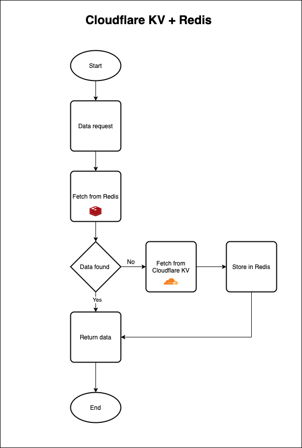

<h1 align="center">
  <a href="https://github.com/marketplace/actions/markdown-autodocs">
    
  </a>
</h1>
<p align="center">Redis caching layer for Cloudflare KV</p>

<p align="center">
    <a href="https://sonarcloud.io/dashboard?id=redis-cloudflare-kv">
        
    </a>
</p>

<p align="center">
    <a href="https://goreportcard.com/report/github.com/dineshsonachalam/redis-cloudflare-kv">
        
    </a>
    <a href="https://github.com/dineshsonachalam/redis-cloudflare-kv/actions/workflows/tests.yml">
        
    </a>
    <a href="https://pkg.go.dev/github.com/dineshsonachalam/redis-cloudflare-kv">
        
    </a>
</p>

Ask questions in the <a href ="https://github.com/dineshsonachalam/redis-cloudflare-kv/issues">GitHub issues</a>


## Why redis-cloudflare-kv?

- redis-cloudflare-kv checks if there is a cached result for a query in Redis. 
- If not found in the cache, it will retrieve data from Cloudflare KV and on successful result cache it in Redis for future queries.

## Application Architecture



## Installation

You need a working Go environment.

```
go get github.com/dineshsonachalam/redis-cloudflare-kv
```

## Quickstart

<!-- MARKDOWN-AUTO-DOCS:START (CODE:src=./.github/examples/main.go) -->
<!-- The below code snippet is automatically added from ./.github/examples/main.go -->
```go
package main

import (
	"fmt"
	"log"
	"os"

	rediscloudflarekv "github.com/dineshsonachalam/redis-cloudflare-kv"
)

func main() {
	// Construct a new KV Client object
	kvClient := rediscloudflarekv.New(
		// REDIS_URL -> TCP Connection:  redis://<user>:<password>@<host>:<port>/<db_number>
		//              UNIX Connection: unix://<user>:<password>@</path/to/redis.sock>?db=<db_number>
		os.Getenv("REDIS_URL"),
		os.Getenv("CLOUDFLARE_ACCESS_KEY"),
		os.Getenv("CLOUDFLARE_EMAIL_ADDRESS"),
		os.Getenv("CLOUDFLARE_ACCOUNT_ID"),
	)
	namespaceID := os.Getenv("TEST_NAMESPACE_ID")
	key1 := "opensource.facebook.react"
	value1 := "A declarative, efficient, and flexible JavaScript library for building user interfaces."
	key2 := "opensource.facebook.react-native"
	value2 := "A framework for building native apps with React."
	key3 := "opensource.facebook.flow"
	value3 := "Adds static typing to JavaScript to improve developer productivity and code quality."
	key4 := "opensource.facebook.docusaurus"
	value4 := "Easy to maintain open source documentation websites."

	// Write writes a value identified by a key in Redis and Cloudflare KV
	status, err := kvClient.Write(key1, []byte(value1), namespaceID)
	if !status && err != nil {
		log.Fatal(err)
	}
	fmt.Printf("Write operation is successful for key: %v\n", key1)

	// Read returns the value associated with the given key
	// If the key is not available in the Redis server,
	// it searches for the key in Cloudflare KV and if the key is available, it writes the key/value in the Redis.
	// Then it returns the value associated with the given key.
	value, err := kvClient.Read(key1, namespaceID)
	if err != nil {
		log.Fatal(err)
	}
	fmt.Printf("Read operation is successful. Key: %v, Value: %v\n", key1, string(value))

	// Delete deletes a key/value in Redis and Cloudflare KV
	status, err = kvClient.Delete(key1, namespaceID)
	if !status && err != nil {
		log.Fatal(err)
	}
	fmt.Printf("Delete operation is successful for key: %v\n", key1)

	kvClient.Write(key2, []byte(value2), namespaceID)
	kvClient.Write(key3, []byte(value3), namespaceID)
	kvClient.Write(key4, []byte(value4), namespaceID)

	// ListKeysByPrefix returns keys that matches the prefix
	// If there are no key's that matches the prefix in the Redis
	// We search for the prefix pattern in Cloudflare KV, if there are keys
	// that matches the prefix, we return the keys.
	keys, err := kvClient.ListKeysByPrefix("opensource.facebook", namespaceID)
	if err != nil {
		log.Fatal(err)
	}
	fmt.Printf("ListKeysByPrefix operation is successful. Keys: %v\n", keys)
}

// Output:
// dineshsonachalam@macbook examples % go run main.go
// Write operation is successful for key: opensource.facebook.react
// Read operation is successful. Key: opensource.facebook.react, Value: A declarative, efficient, and flexible JavaScript library for building user interfaces.
// Delete operation is successful for key: opensource.facebook.react
// ListKeysByPrefix operation is successful. Keys: [opensource.facebook.docusaurus opensource.facebook.react-native opensource.facebook.flow]
```
<!-- MARKDOWN-AUTO-DOCS:END -->

## License

[MIT](https://choosealicense.com/licenses/mit/) © [dineshsonachalam](https://www.github.com/dineshsonachalam)